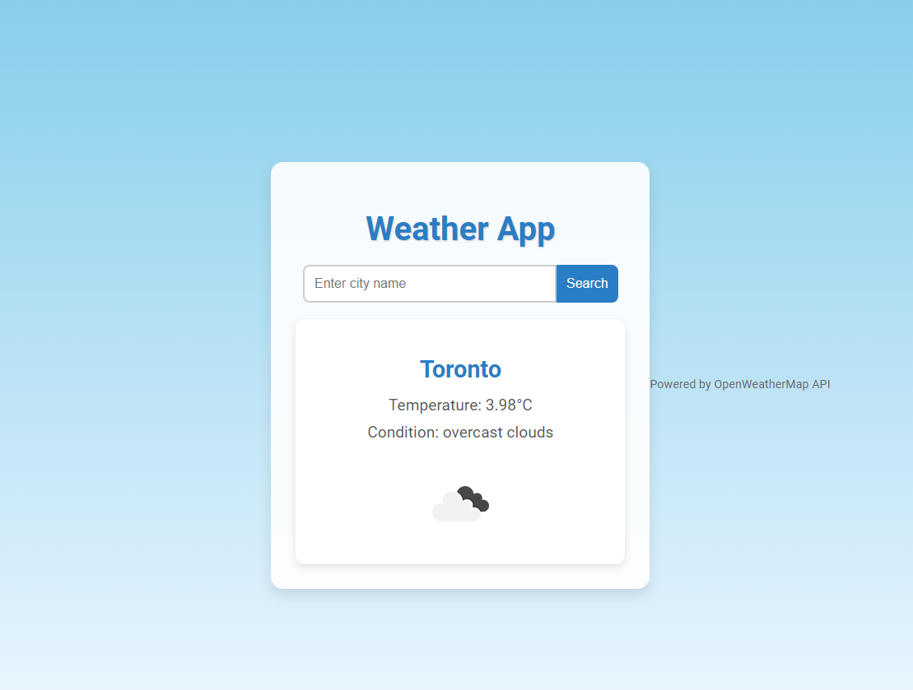
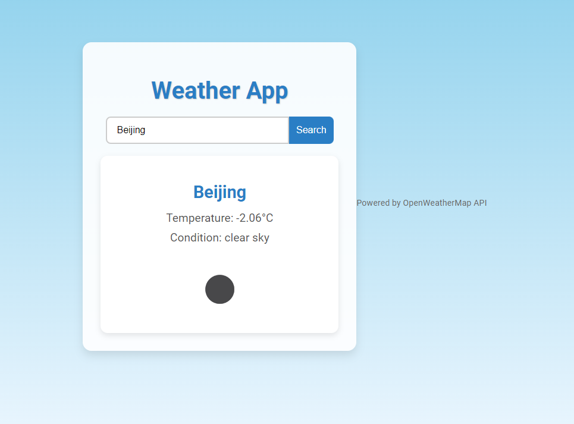

# Weather App

This project is a simple weather app built using React. It fetches weather data from the OpenWeatherMap API and displays it dynamically.

## Features
- Search for any city to get current weather details.
- Displays temperature, weather condition, and an icon.

## How to Run
1. Clone this repository:
   ```bash
   git clone https://github.com/123456995/101419665_comp3123_labtest2.git
   cd 101419665_COMP3123_LABTEST2

   

   
   
   